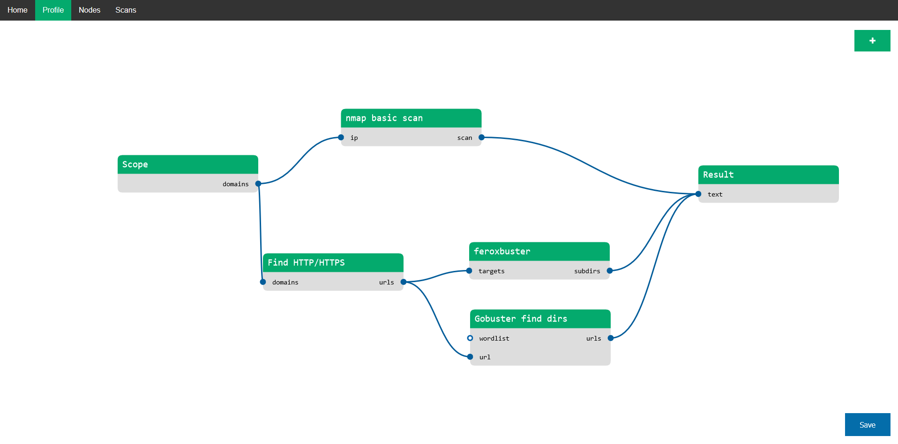

# BBPipeline: Pentesting and Bug Bounty Workflow Automation

> [!note]
> BBPipeline is a work in progress, and we appreciate your feedback and contributions to make it even more powerful and user-friendly. Feel free to reach out for support or to report issues. Happy testing!

## Overview



BBPipeline is a powerful open-source tool designed to streamline and automate pentesting and bug bounty workflows. This project provides a graphical interface with nodes, making it easy for security professionals and bug bounty hunters to create, customize, and execute complex security testing scenarios.

## Features

- **Graphical Node Interface:** Easily design and visualize your workflow with a user-friendly graphical interface.
- **Workflow Automation:** Automate repetitive tasks and complex testing scenarios to enhance efficiency.
- **Python-based:** Written in Python for flexibility, extensibility, and compatibility with a wide range of security tools.
- **Customizable:** Tailor workflows to your specific needs by adding or modifying nodes and actions.
- **Collaborative:** Share and collaborate on workflows within the security community to enhance collective knowledge.

## Getting Started

### Prerequisites

- Python 3.x installed
- Pip package manager

### Installation

1. Clone the repository:

   ```bash
   git clone https://github.com/ArturLukianov/BBPipeline/
   ```

2. Navigate to the project directory:

   ```bash
   cd BBPipeline
   ```

3. Install dependencies:

   ```bash
   pip install -r requirements.txt
   ```

### Usage

1. Run BBPipeline:

   ```bash
   python bbp.py
   ```

2. Open the web application on http://127.0.0.1:5000 and start creating your workflow using the graphical interface.

